# 3WD-ToM

**Multi-Agent Theory-of-Mind Reasoning in Werewolf**

3WD-ToM is a research codebase for collecting, modeling, and evaluating
observer-specific beliefs in a fixed seven-player Werewolf game. The project
combines a controlled language-game environment, private planning and public
speech generation, structured speech perception, belief self-reporting, and
first- and second-order Theory-of-Mind (ToM) training.

The current collection generator is frozen as **Collection V2.7** at commit
`844784d7232af7e40633b62c450f72e4c35edb8e`. See
[the freeze provenance](docs/collection_freeze_v2.7.md) for the experimental
record.

## Research question

Werewolf requires agents to reason under hidden identities, asymmetric private
knowledge, strategic speech, and changing public evidence. 3WD-ToM studies
whether a model can represent how different players update their beliefs over
the two hidden Werewolves at the same public-history cutoff.

The canonical setup contains:

- seven players;
- two Werewolves;
- one Seer;
- one Witch;
- three Villagers;
- multi-day public speech, voting, and night actions.

## Theory-of-Mind task

Each sample is tied to one append-only public-event prefix.

- **First-order ToM** predicts the current observer's belief from public
  history plus that observer's legal private knowledge.
- **Second-order ToM** predicts observer-specific beliefs from public history
  alone. At the formal boundary, all label-valid rows other than the current
  reasoning player's own row are supervised. This scope is named
  `all_valid_other_observers`.

The formal second-order boundary is
`post_completed_public_speech_pre_next_action_v1`: a complete public speech,
including its structured speech actions, has been committed and the next
reasoning player has not yet generated an action. Vote-, phase-, exile-,
death-, and other system-only boundaries are not formal supervision points.

The complete research contract is documented in
[docs/twd_tom_contract.md](docs/twd_tom_contract.md).

## 21-class target

With seven players and exactly two Werewolves, there are
`C(7, 2) = 21` unordered Werewolf pairs. A belief report contains the
observer's `suspected_werewolves` together with supervision-side hard
knowledge. The explicit projection assigns deterministic weights to the
hard-legal pairs and normalizes them into a 21-class probability target.

Raw reports, deterministic projection, model inputs, and supervision masks
remain separate contracts. The projection never changes the public-history
cutoff or injects future information into model inputs.

## Architecture

```mermaid
flowchart LR
    E["Werewolf environment"] --> O["Private observation"]
    O --> P["Private Planner"]
    P --> PP["PublicSpeechPlan"]
    PP --> R["Renderer"]
    R --> V["Final speech validator"]
    V --> S["Public speech"]
    S --> SP["SpeechPerceiver"]
    S --> FH["Frozen full public-event history<br/>raw_text + sp_actions"]
    SP --> FH

    O --> BR["Ordinary private-conditioned reporter"]
    FH --> BR
    FH --> POR["Explicit Public-only reporter"]
    POR --> PSW["Public-only suspected_werewolves"]
    BR --> OSW["Ordinary suspected_werewolves"]
    PSW --> PR["Deterministic pair projection"]
    OSW --> PR
    PR --> T["21-class target"]
    FH --> SF["Structured raw-text-free<br/>public-event features"]
    SF --> D["TWDToMDataset"]
    T --> D
    D --> M["ToM backbone"]
    M --> L["Masked soft-target loss / evaluation"]
```



See [docs/architecture.md](docs/architecture.md) for the gameplay, speech,
belief, and training flows.

## Repository structure

| Path | Purpose |
|---|---|
| `werewolf/` | Core environment, agents, backends, speech components, and ToM implementation |
| `script/twd_tom/` | Collection, processing, audit, training, and evaluation CLIs |
| `tests/` | Deterministic regression tests grouped by subsystem |
| `configs/` | Reusable gameplay and collection profiles |
| `docs/` | Research contract, architecture, provenance, and deployment guidance |
| `run_battle.py` | One configured game |
| `run_random.py` | Randomized profile assignment and optional shadow inference |
| `run_batch.sh` | Simple repeated-game wrapper |

A more detailed map and the source/runtime boundary are in
[docs/repository_structure.md](docs/repository_structure.md).

## Installation

Python 3.10 or newer is required. Use an isolated environment; do not copy a
local or server Conda environment into the repository.

```bash
python -m venv .venv
source .venv/bin/activate
python -m pip install --upgrade pip
python -m pip install -e .
```

Install the ToM training stack and test tools when needed:

```bash
python -m pip install -e ".[tom,dev]"
```

Create a local secret file only for backends that require credentials:

```bash
cp .env.example .env
```

The tracked YAML files contain backend aliases, endpoint profiles, and model
IDs, but no API keys. See [configs/README.md](configs/README.md).

## Data policy

The Git repository intentionally excludes:

- raw and processed datasets;
- game and backend-call logs;
- model weights and checkpoints;
- evaluation/review archives;
- resolved run artifacts;
- local Python or Conda environments;
- provider caches.

Store these artifacts on external runtime storage. The logical repository
roots `data/`, `datasets/`, `logs/`, `outputs/`, `review/`, `checkpoints/`,
and root-level `models/` are ignored. Source code under `werewolf/models/` is
not ignored.

Public SFT data is not bundled. The upstream raw game data referenced by the
base project is available from the
[Werewolf Game Reasoning dataset](https://huggingface.co/datasets/ReneeYe/werewolf_game_reasoning).

## Collection

The canonical collection interface is the explicit-stage pipeline. Validate
the configuration before using a new run ID:

```bash
python -m script.twd_tom.pipeline \
  --config configs/twd_tom_server_qwen35_9b.yaml \
  --run-id <UNIQUE_RUN_ID> \
  --stage validate \
  --game-count 5 \
  --seeds <SEED_1> <SEED_2> <SEED_3> <SEED_4> <SEED_5>

python -m script.twd_tom.pipeline \
  --config configs/twd_tom_server_qwen35_9b.yaml \
  --run-id <UNIQUE_RUN_ID> \
  --stage collect \
  --game-count 5 \
  --seeds <SEED_1> <SEED_2> <SEED_3> <SEED_4> <SEED_5>
```

Each stage is explicit; collection does not automatically run projection,
split, training, or evaluation. This canonical pipeline retains the ordinary
private-conditioned collection contract. Public-only collection is a separate,
explicit lineage selected by `formal_batch_collection --collection-mode
public_only`; it is not an automatic mode of every pipeline stage.

Other maintained entry points have narrower roles:

- `python -m script.twd_tom.collect` collects one subjective-ToM game to an
  explicitly selected JSONL path.
- `python -m script.twd_tom.formal_batch_collection` runs a monitored,
  request-bounded ten-game batch utility.
- `python -m script.twd_tom.real_backend_dry_run` is a two-game,
  privacy-safe audit harness; the pipeline also reuses its audited per-game
  collection core.
- `python -m script.twd_tom.reparse_speeches` reparses existing public
  speeches for offline comparison and does not rerun gameplay.

These utilities are not fallback paths and are not invoked automatically by
the canonical pipeline.

## Projection and split

Projection and split are separate explicit stages:

```bash
python -m script.twd_tom.pipeline \
  --config configs/twd_tom_server_qwen35_9b.yaml \
  --run-id <RUN_ID> \
  --stage project

python -m script.twd_tom.pipeline \
  --config configs/twd_tom_server_qwen35_9b.yaml \
  --run-id <RUN_ID> \
  --stage split
```

The order-specific formal training splitter is
`python -m script.twd_tom.split_training_data`; its exact contract is
documented in [docs/twd_tom_contract.md](docs/twd_tom_contract.md).

## Training

Train first- and second-order models independently with explicit train and
validation JSONL files. The default backbone is `qwen2_model`; the CLI also
retains the directly constructed `gpt2_block` experimental backbone.

```bash
python -m script.twd_tom.train \
  --dataset datasets/<dataset-id>/formal/tom1/train.jsonl \
  --validation-dataset datasets/<dataset-id>/formal/tom1/validation.jsonl \
  --tom-order 1 \
  --backbone qwen2_model \
  --output-dir outputs/<experiment-id> \
  --device auto \
  --seed 42

python -m script.twd_tom.train \
  --dataset datasets/<dataset-id>/formal/tom2/train.jsonl \
  --validation-dataset datasets/<dataset-id>/formal/tom2/validation.jsonl \
  --tom-order 2 \
  --backbone qwen2_model \
  --output-dir outputs/<experiment-id> \
  --device auto \
  --seed 42
```

Training records the source commit, clean-worktree assertion, data hashes,
environment versions, device, and seed in its run provenance.

## Evaluation

Evaluate validation or test data with an explicit checkpoint and dataset:

```bash
python -m script.twd_tom.eval \
  --checkpoint outputs/<experiment-id>/tom_order_2/best.pt \
  --dataset datasets/<dataset-id>/formal/tom2/validation.jsonl \
  --training-dataset datasets/<dataset-id>/formal/tom2/train.jsonl \
  --output outputs/<experiment-id>/tom_order_2/validation_metrics.json \
  --device auto
```

Pre-V2.7 `data/qwen25/...` paths are retained only as historical layouts; they
are not the canonical location for a new V2.7 dataset or experiment.

Validation is used before final model selection. Test data should be evaluated
only after the model and hyperparameters are fixed.

## Testing

The ordinary suite uses mocks and small fixtures; it does not require a model
server, GPU, API key, or formal dataset.

```bash
python -m compileall script werewolf tests
python -m pytest -q
```

Formal-data smoke tests are opt-in and read-only:

```bash
RUN_TWD_TOM_REAL_DATA_TESTS=1 python -m pytest -q tests/twd_tom
```

## Collection Freeze V2.7

- Freeze commit: `844784d7232af7e40633b62c450f72e4c35edb8e`
- Freeze pilot: seeds 555–574
- Independent runs: four runs of five games
- Completion: 20 / 20 games
- Final audit: PASS

The repository does not contain the corresponding game logs, data, audit
archives, or model weights. Reproducibility depends on the source commit, run
manifest, resolved config, and seed range recorded with external artifacts.

## Upstream / project origin

3WD-ToM is derived from the implementation accompanying
[Multi-agent KTO: Reinforcing Strategic Interactions of Large Language Model in Language Game](https://arxiv.org/abs/2501.14225).
This attribution records the project origin; the current repository's primary
research focus is the 3WD-ToM collection and modeling pipeline described
above.

## Citation

Formal citation metadata has not yet been approved for this derived project.
The project owner should provide the final title, author order, affiliations,
and paper identifier before a `CITATION.cff` is added.

## License

This repository does not currently contain a repository-level license file.
The project owner and supervising team must decide the code and artifact
license before public distribution.
