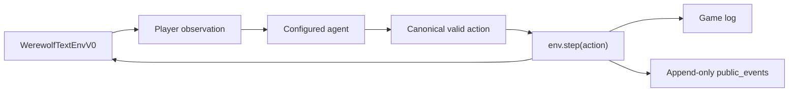
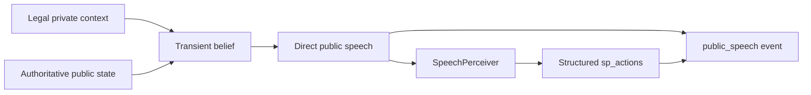
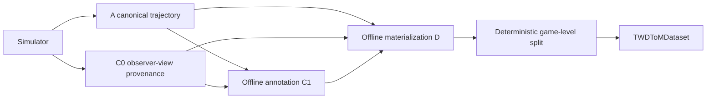
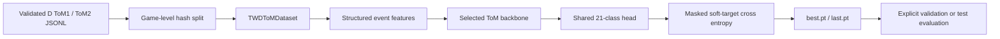

# Architecture

This document maps the current implementation without introducing components
that are not present in the repository. Collection V2.7 runtime paths are
frozen; the diagrams describe them but do not redefine their behavior.

## Gameplay flow

`werewolf/envs/werewolf_text_env_v0.py` owns phases, legal actions, state
transitions, observations, game logs, and public-event publication. Agent
construction and backend routing are performed by `run_battle.py` or
`run_random.py`; the environment does not resolve API credentials or model
names.

## Public speech flow

The strict speech path is orchestrated by `GPTAgent`. A fresh transient belief
is generated from the legally filtered observation, then a second model call
produces natural-language public speech directly. Prompt construction lives in
`prompt_template_v0.py`. The online `SpeechPerceiver.parse()` remains tolerant
and runs only after speech generation, so parser failure does not stop a game;
strict parsing is reserved for offline audit tools.

## Canonical trajectory and supervision flow

`CanonicalGameInteractionTrajectoryRecorder` is the only current-mainline
gameplay collector. It records A transitions and C0 PRE/POST observer views;
it does not call a label reporter. `werewolf.offline_annotation` derives C1
private-conditioned and public-only suspicion annotations from frozen A/C0.
`werewolf.offline_materialization` validates those sources and emits D ToM1
and ToM2 records. Deterministic observer hard knowledge is owned by
`werewolf/observer_knowledge.py`. The reproducible filesystem entry point for
these offline stages is `script/twd_tom/materialize_canonical_dataset.py`.

The historical online belief collectors and the earlier formal-ToM pilot are
preserved under `archive/legacy_tom`; they are not sources for canonical D.

## Training flow

`script/twd_tom/train.py` and `script/twd_tom/eval.py` are the formal model
entry points. Training and validation datasets are explicit and game-disjoint.
The default backbone is a randomly initialized `Qwen2Model` receiving
`inputs_embeds`; the CLI also retains a direct `GPT2Block` stack. Neither path
downloads pretrained weights or tokenizes raw speech.

## Source locations

| Concern | Location |
|---|---|
| Environment | `werewolf/envs/` |
| Agent and speech-plan contracts | `werewolf/agents/` |
| Backend abstraction | `werewolf/backends/` |
| Speech perception and belief reporting | `werewolf/speech/` |
| Canonical trajectory and offline labels | `werewolf/trajectory.py`, `werewolf/offline_annotation.py`, `werewolf/offline_materialization.py` |
| ToM schemas, Dataset, model, loss, metrics | `werewolf/models/twd_tom/` |
| Collection and processing CLIs | `script/twd_tom/` |
| Historical ToM implementations | `archive/legacy_tom/` |
| Deterministic regressions | `tests/` |
