# tom-v2 架构

## 研究定义

tom-v2 预测目标玩家在时间 `t` 的主观狼人怀疑：

```text
输入：public_history <= t + observer_id
输出：B_t(observer, target_player)
```

标签只能由被建模的 playing agent 自己报告，不能由外部模型根据公开信息推断。

## 当前数据主线

```mermaid
flowchart LR
    E[Classic-7 Environment] --> C[发言前冻结公开历史]
    C --> O[按 observer 取得合法私有 observation]
    O --> Q[playing-agent readonly belief query]
    Q --> R[suspected_werewolves 符号集合]
    R --> J[raw belief snapshot JSONL]
    J --> M[按 game 进行 canonical materialization]
    M --> D[稀疏集合到 belief row 转换]
    D --> T[7×7 observer-conditioned target]
```



同一冻结边界用于所有观察者。collector 只选择公开存活玩家，不接收真实角色标签；每次 query 前后比较 playing agent 状态，任何状态变化都直接失败。

## 不属于主线的路径

- public-only belief reporter；
- external offline reporter / offline annotation；
- Public Belief Matrix；
- ToM1/ToM2 双任务；
- pair classification 与 21 类狼人组合标签；
- online shadow inference；
- tom-v1 formal reporter 与 pilot pipeline。

Dataset 只以结构化公开事件作为模型特征。非空怀疑集合只在集合成员上均分，空集合在六个非自身玩家上均分；`observer_alive_mask` 控制有效行，`diagonal_target_mask` 只排除自身列。死亡玩家仍保留为 target。raw hard knowledge 只做 provenance、合法性与泄漏审计，不约束 self-report，也不进入模型特征。

## 模型目标

模型通过结构化公开事件的因果编码和共享 observer query，直接输出
`belief_logits[B, 7, 7]`。第二维对应 observer，第三维对应 target player。
训练损失仅聚合 `observer_alive_mask` 选中的行，并在每行 softmax 前用
`diagonal_target_mask` 排除自身列。不存在 21 类组合空间、pair 投影或私有知识输入。

训练时可应用通用座位循环旋转：同一置换同时作用于 observer、target、公开事件中的玩家引用、belief target 的行列以及 mask；验证和 evaluation 不旋转。
