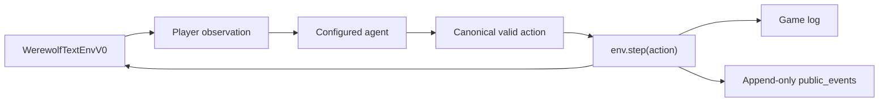
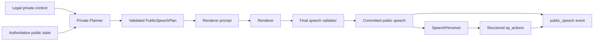
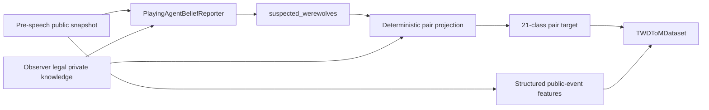
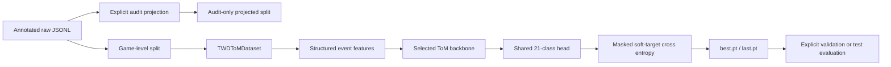

# Architecture

This document maps the current implementation without introducing components
that are not present in the repository. Collection V2.7 runtime paths are
frozen; the diagrams describe them but do not redefine their behavior.

## Gameplay flow

`werewolf/envs/werewolf_text_env_v0.py` owns phases, legal actions, state
transitions, observations, game logs, and public-event publication. Agent
construction and backend routing are performed by `run_battle.py` or
`run_random.py`; the environment does not resolve API credentials or model
names.

## Public speech flow

The strict speech path is orchestrated by `GPTAgent`. The plan schema and hard
validation live with the LLM agent contract; prompt construction lives in
`prompt_template_v0.py`. The Renderer receives the validated public plan and
public phase context, not the Planner's private prompt. The online
`SpeechPerceiver.parse()` remains tolerant so parser failure does not stop a
game; strict parsing is reserved for offline audit tools.

## Belief supervision flow

The reporter obtains a detached self-report from each valid observer at one
shared public-history cutoff. Supervision-side hard knowledge constrains the
target projection but does not enter second-order model inputs.

The formal second-order boundary is
`post_completed_public_speech_pre_next_action_v1`. The effective supervision
scope is `all_valid_other_observers`: the sample's valid `subject_mask` is
intersected with all canonical observer rows except the current reasoning
player. The latest speech actor does not define the supervised row set.

## Training flow

`script/twd_tom/train.py` and `script/twd_tom/eval.py` are the formal model
entry points. Training and validation datasets are explicit and game-disjoint.
The default backbone is a randomly initialized `Qwen2Model` receiving
`inputs_embeds`; the CLI also retains a direct `GPT2Block` stack. Neither path
downloads pretrained weights or tokenizes raw speech.

## Source locations

| Concern | Location |
|---|---|
| Environment | `werewolf/envs/` |
| Agent and speech-plan contracts | `werewolf/agents/` |
| Backend abstraction | `werewolf/backends/` |
| Speech perception and belief reporting | `werewolf/speech/` |
| ToM schemas, Dataset, model, loss, metrics | `werewolf/models/twd_tom/` |
| Collection and processing CLIs | `script/twd_tom/` |
| Deterministic regressions | `tests/` |
