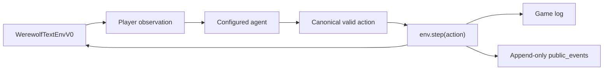
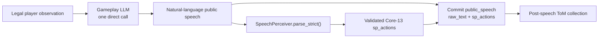
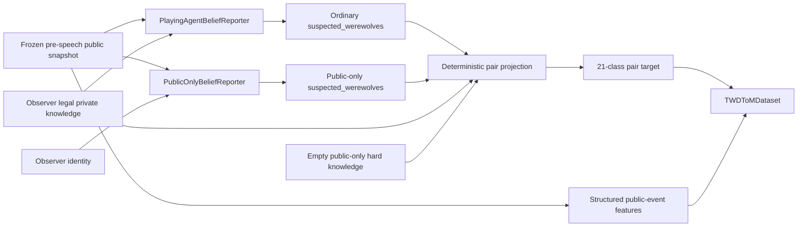
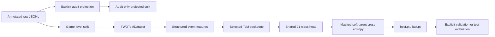

# Architecture

This document maps the current implementation without introducing components
that are not present in the repository. Collection V2.7 runtime paths are
frozen; the diagrams describe them but do not redefine their behavior.

## Gameplay flow

`werewolf/envs/werewolf_text_env_v0.py` owns phases, legal actions, state
transitions, observations, game logs, and public-event publication. Agent
construction and backend routing are performed by `run_battle.py` or
`run_random.py`; the environment does not resolve API credentials or model
names.

## Public speech flow

`GPTAgent` builds one minimal direct-speech prompt from the current player's
legal observation and makes one Gameplay LLM call. There is no active Planner,
`PublicSpeechPlan`, Renderer, `PLAN_RENDER` mode, `gameplay_prompt_profile`, or
Planner/SpeechPerceiver alignment gate. The returned natural-language string is
passed unchanged to online `SpeechPerceiver.parse_strict()`. Valid Core-13
actions are committed, and a successful empty list is legal semantic NONE.
Backend, protocol, schema, or subject failures remain explicit rather than
being converted to `[]`; parsing and validation finish before `raw_text` and
`sp_actions` are committed. Existing post-speech ToM collection then consumes
the committed event. Core-13 remains the downstream representation, and raw
natural-language speech does not directly enter the ToM backbone.

## Belief supervision flow

The ordinary reporter obtains a detached, private-conditioned self-report from
each valid observer. The separate Public-only reporter receives only the same
frozen public snapshot and observer identity; its raw hard-knowledge mappings
are empty. Both lineages use the existing deterministic 21-class pair
projection. Supervision-side hard knowledge in the ordinary lineage constrains
the target but does not enter second-order model inputs. The canonical
explicit-stage pipeline remains ordinary; monitored formal collection exposes
Public-only as an explicit collection mode.

The formal second-order boundary is
`post_completed_public_speech_pre_next_action_v1`. The effective supervision
scope is `all_valid_other_observers`: the sample's valid `subject_mask` is
intersected with all canonical observer rows except the current reasoning
player. The latest speech actor does not define the supervised row set.

## Training flow

`script/twd_tom/train.py` and `script/twd_tom/eval.py` are the formal model
entry points. Training and validation datasets are explicit and game-disjoint.
The default backbone is a randomly initialized `Qwen2Model` receiving
`inputs_embeds`; the CLI also retains a direct `GPT2Block` stack. Neither path
downloads pretrained weights or tokenizes raw speech.

## Source locations

| Concern | Location |
|---|---|
| Environment | `werewolf/envs/` |
| Agent and speech-plan contracts | `werewolf/agents/` |
| Backend abstraction | `werewolf/backends/` |
| Speech perception and belief reporting | `werewolf/speech/` |
| ToM schemas, Dataset, model, loss, metrics | `werewolf/models/twd_tom/` |
| Collection and processing CLIs | `script/twd_tom/` |
| Deterministic regressions | `tests/` |
